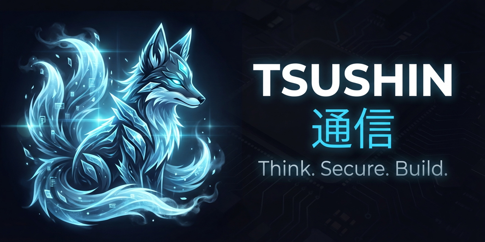

<p align="center">
  
</p>

<p align="center">
  <a href=""></a>
  <a href=""></a>
  <a href="https://opensource.org/licenses/MIT"></a>
</p>

**Tsushin** (通信 — "Communication" in Japanese) is a multi-tenant agentic messaging platform that unifies AI agent orchestration, conversational channels, semantic memory, workflow automation, AI-powered security, and observability — self-hostable, with RBAC and full multi-tenancy.

> 📖 **Full reference:** see **[docs/documentation.md](docs/documentation.md)** for the exhaustive technical guide covering every configuration item, feature, form field, channel, integration, API endpoint, and appendix.
>
> 📘 **User guide:** see **[docs/user-guide.md](docs/user-guide.md)** for a practical walkthrough of setting up channels, creating agents, configuring skills, building flows, using slash commands, and more.

---

## Feature Highlights

- **Multi-agent orchestration** — per-agent personas, tone presets, memory modes (isolated / channel / shared), keyword triggers, and dynamic agent switching.
- **6 channels** — WhatsApp (WAHA), Telegram, Slack, Discord, HTTP Webhook (HMAC-signed), and a built-in Playground web chat.
- **10+ LLM providers** — OpenAI, Anthropic, Gemini, Groq, Grok, DeepSeek, Ollama, OpenRouter, Vertex AI, and any OpenAI-compatible endpoint. Provider instances are configured per-tenant via the Hub.
- **4-layer memory** — working, episodic, semantic (with temporal decay), and shared memory pool; optional OKG (Ontology Knowledge Graph).
- **Vector stores** — Chroma (built-in), Qdrant (auto-provisioned during setup when available), Pinecone, or MongoDB Atlas.
- **19 built-in skills** — audio TTS/transcription, web search, scraping, browser automation, Gmail, flight search, scheduler, knowledge sharing, OKG terms, sandboxed shell/network tools, and more.
- **Custom skills** — Instruction, Script (Python/Bash/Node), and MCP-server skills, gated by a Sentinel scan at save-time.
- **37 slash commands** — agent management, email (Gmail), web search, shell, thread control, sandboxed tools, flows, scheduler, memory, project context, and system commands — all with per-contact access control.
- **Sandboxed tools** — per-tenant Docker containers with `nmap`, `nuclei`, `dig`, `httpx`, `whois`, `katana`, `subfinder`, `sqlmap`, and a generic webhook tool. Invoked via `/tool <name> <cmd> param=value`.
- **Flows** — 4 flow types (conversation, notification, workflow, task) with immediate, scheduled, or recurring (cron) execution; 8 step types with template-variable interpolation.
- **Sentinel security** — AI-powered detection of prompt injection, agent takeover, poisoning, shell malicious intent, memory poisoning (MemGuard), browser SSRF, and vector-store poisoning. Profiles with block / warn-only / detect-only / off modes.
- **Studio** — visual agent builder, personas, contacts, projects (knowledge isolation), custom skills, and agent-to-agent communication.
- **Playground** — real-time streaming chat, audio recording + Whisper transcription, document-only uploads, command palette, memory inspector, expert mode.
- **Watcher** — observability dashboard with conversations, flows, security events, channel health, billing, and a graph view.
- **Public API v1** — OAuth2 client credentials + direct API key, rate-limited, 40+ endpoints (agents, chat, flows, hub, studio, resources).
- **Multi-tenancy & RBAC** — 4 built-in roles (owner / admin / member / readonly), 47 permission scopes, per-tenant isolation, envelope-encrypted per-service keys.
- **Audit & compliance** — tenant-scoped audit events, CSV export, per-tenant retention, RFC 5424 syslog streaming (TCP / UDP / TLS).
- **Cloud-native** — Docker Compose (dev), Helm chart at `k8s/tsushin/` (GKE), GCP Secret Manager backend, Prometheus metrics at `/metrics`.

---

## What's New in v0.6.0

v0.6.0 promotes a substantial upgrade from the 0.5.0 line. Headline changes since the last `main` release:

**Channels & Communication**
- **Slack and Discord — first complete end-to-end** (V060-CHN-001/002/031). Slack runs on both Socket Mode (self-managed `SocketModeClient` per integration) and HTTP Events; Discord runs on HTTP Interactions with per-tenant Ed25519 signature verification. Threaded replies are preserved (`thread_ts`), bot-authored messages are filtered to prevent reply loops, and every saved token uses per-tenant PBKDF2-derived Fernet encryption (closes a silent token-decrypt regression).
- **Guided setup wizards** — `SlackSetupWizard` (5 steps, pre-filled Slack app manifest JSON) and `DiscordSetupWizard` (6 steps, including user-install fallback for accounts without Manage Server permission). Replaces the old bare-token modals that had users hunting the Slack/Discord portals blind.
- **Tenant Public Base URL** — new `tenant.public_base_url` setting (migration `0034`) surfaces the exact webhook URLs to paste back into the Slack Events / Discord Interactions portals, with inline `cloudflared tunnel --url http://localhost:8081` guidance when unset.
- **Remote Access via Cloudflare Tunnel** — per-tenant gated public exposure for HTTP-path channel integrations.
- **Agent ↔ Channel binding UI** — `AgentChannelsManager` now renders Slack and Discord cards alongside Playground/WhatsApp/Telegram/Webhook, with an instance selector per channel.

**Memory & Knowledge**
- **Vector Stores** — per-agent override/complement/shadow modes with a creation wizard that can attach the new store to existing agents in one flow. Chroma (built-in), Qdrant (auto-provisioned when available), Pinecone, MongoDB Atlas.
- **Own Knowledge Graph (OKG)** — `okg_store` / `okg_recall` / `okg_forget` multi-tool registration; LLM-argument coercion handles common string↔array and string↔boolean mismatches so tool calls don't fail on shape.
- **Memory tenant-scoping** — defense-in-depth `tenant_id` filter added to every read/delete path (`agent_memory_system`, `memory_management_service`, `routes_memory`, playground services) in addition to the write-side column that shipped in 0.5.0.

**AI Provider Efficiency**
- **Anthropic prompt caching** — 3 breakpoint `cache_control` with a relocation trick for the dynamic tail; 40–65% token-cost reduction for chat-heavy workloads.
- **Default Anthropic model** bumped to `claude-haiku-4-5`.

**Security & Sentinel**
- **Sentinel parser** now derives valid threat types dynamically from `DETECTION_REGISTRY` instead of a hard-coded 5-entry allowlist. Regression tests (`test_sentinel_unified_parse.py`, 10 cases) guard against future re-introduction.
- **Docker hardening, per-client rate limits, PostgreSQL password rotation** (BUG-055/057/062).
- **BUG-LOG-015** — memory tenant-scoping read-path bypass fully closed, with `test_memory_tenant_scoping.py` (7 cases) asserting tenant isolation at query level.

**Installer & Deployment**
- **IP-address installs** — self-signed SAN now emits `IP:<addr>,DNS:localhost,IP:127.0.0.1,IP:::1` (previously invalid `DNS:<IP>`, rejected by browsers/curl). Stale-SAN auto-detection and regeneration on installer re-runs.
- **Let's Encrypt staging mode** (`--le-staging`) — uses the LE staging directory so operators can rehearse the full ACME flow without burning production rate-limit budget.
- **Manual-cert pre-flight validation** — key↔cert match, expiry window, SAN coverage, optional intermediate chain bundle support (resolves deployments behind Sectigo/GoDaddy).
- **SSL config persistence** across installer re-runs (`SSL_LE_STAGING`, `SSL_CERT_PATH`, `SSL_KEY_PATH`, `SSL_CERT_CHAIN_PATH`).
- **Frontend rebuild on `NEXT_PUBLIC_API_URL` change** — the installer diffs the previous `.env` and rebuilds the image no-cache instead of silently shipping a stale cached bundle.

**Platform & Tooling**
- **Next.js 16** upgrade — `outputFileTracingRoot`, `turbopack.root`, typed-routes reference in `next-env.d.ts`.
- **Flows integration** — `flows_skill` now queries `AgentSkillIntegration` first (fixes Google Calendar provider being ignored in favor of config defaults). BUG-559 fully resolved.
- **Automation skill** — strips embedded `"\"…\""` quotes around `flow_identifier` before lookup so LLM-formatted tool arguments stop failing with "Flow not found".
- **Agent switcher** default execution mode → `hybrid` (keyword + LLM tool paths both active).
- **WhatsApp LID migration** — Contact auto-linking, UserAgentSession fallback via phone number, and ContactAgentMapping dual-key lookup handle WhatsApp's phone-ID → Linked-ID transition.
- **TTS pipeline** — `tenant_id` now propagates end-to-end (router → TTS skill → provider → `get_api_key`). Provider-instance fallback means tenants no longer need a duplicate "Service API Key" row just for TTS.
- **Web search provider switching** (Brave ↔ Google/SerpAPI), **Flight search** (Google Flights via SerpAPI), **Gmail + Google Calendar** skills — all verified end-to-end against live providers.
- **Logout spinner fix (BUG-544)** — hard navigation replaces the async `router.push('/auth/login')` that could leave `/` stuck on the loading screen.
- **Graph View** — WebSocket resilience (indefinite reconnect + `visibilitychange` listener), brighter glow, target-node pulse during A2A, stale A2A-edge auto-cleanup.

**Full change log**: [docs/changelog.md](docs/changelog.md) contains ~50 detailed entries for every fix, migration, wizard step, and regression-test suite that shipped in this release.

---

## Quick Start

### Prerequisites
- **Docker & Docker Compose V2**
- **Python 3.8+** with **pip** (installer only)
- **Git**

> The Docker network `tsushin-network` must exist before `docker compose up`. The installer creates it automatically. Manual: `docker network create tsushin-network`.

### Installation

```bash
# 1. Clone
git clone https://github.com/iamveene/Tsushin.git
cd Tsushin

# 2. Run installer (interactive — prompts for ports, access type, SSL)
python3 install.py

# Unattended, self-signed HTTPS, auto-detected IP
python3 install.py --defaults

# Unattended with Let's Encrypt SSL
python3 install.py --defaults --domain app.example.com --email you@example.com

# Let's Encrypt staging (for testing, avoids production rate limits)
python3 install.py --defaults --domain app.example.com --email you@example.com --le-staging

# See all options
python3 install.py --help

# 3. Open the URL printed at the end and finish the /setup wizard:
#    create admin account + configure at least one AI provider API key.
```

The installer handles infrastructure only (containers, networking, SSL, `.env` secrets). Organization setup and LLM provider keys are configured per-tenant through the `/setup` wizard and Hub UI — not via environment variables — enabling multi-tenant isolation.

For the Parallels Ubuntu VM workflow used in fresh-install audits, you can sync the repo from your Mac with `bash deploy-to-vm.sh`, then SSH to the VM and run `sudo python3 install.py` from `~/tsushin`.

For SSL installs, the generated Caddy config now targets stack-scoped upstreams such as `${TSN_STACK_NAME}-frontend` and `${TSN_STACK_NAME}-backend`. That keeps `https://localhost` pinned to the intended stack even when multiple Tsushin instances share `tsushin-network`.

→ Full deployment options, GKE/Helm, GCP Secret Manager, and rebuild-safety rules: see [docs/documentation.md §4 Deployment & Operations](docs/documentation.md#4-deployment--operations).

### Verify

```bash
curl http://localhost:8081/api/health      # Liveness
curl http://localhost:8081/api/readiness   # Readiness (checks PostgreSQL)
docker compose ps                          # Container states
```

---

## Architecture

```
┌──────────────────────────────────────────────────────────────────────────────┐
│                           TSUSHIN PLATFORM                                   │
├──────────────────────────────────────────────────────────────────────────────┤
│                                                                              │
│  ┌──────────────┐     ┌──────────────────┐     ┌──────────────────────────┐  │
│  │ Frontend UI  │     │   Backend API    │     │      RBAC Layer          │  │
│  │  Next.js 16  │◄───►│ FastAPI + PG 16  │◄───►│  Auth / Tenants / Roles  │  │
│  └──────────────┘     └────────┬─────────┘     └──────────────────────────┘  │
│                                │                                             │
│         ┌──────────────────────┼──────────────────────────┐                  │
│         │                      │                          │                  │
│         ▼                      ▼                          ▼                  │
│  ┌──────────────┐     ┌───────────────┐     ┌─────────────────────┐         │
│  │     CORE     │     │      HUB      │     │       STUDIO        │         │
│  │ Agent Engine │     │ AI Providers  │     │ Agents   Personas   │         │
│  │ 19 Skills    │     │ Comm Channels │     │ Contacts Projects   │         │
│  │ Sentinel     │     │ Tool APIs     │     │ Tone Presets        │         │
│  └──────┬───────┘     └───────┬───────┘     └─────────────────────┘         │
│         │                     │                                              │
│         ▼                     ▼                                              │
│  ┌──────────────┐     ┌───────────────┐     ┌─────────────────────┐         │
│  │    FLOWS     │     │    MEMORY     │     │      WATCHER        │         │
│  │ 4 types      │     │ Working       │     │ Dashboard  Billing  │         │
│  │ 7 step types │     │ Episodic      │     │ Convos     Security │         │
│  │ Scheduler    │     │ Semantic      │     │ Flows   Graph View  │         │
│  │ Templates    │     │ Shared        │     │                     │         │
│  └──────────────┘     └───────────────┘     └─────────────────────┘         │
│                                                                              │
│  ┌──────────────────────────────┐     ┌──────────────────────────────────┐   │
│  │      SANDBOXED TOOLS         │     │          CHANNELS                │   │
│  │ Per-tenant Docker isolation  │     │ WhatsApp │ Telegram │ Slack      │   │
│  │ 9 pre-installed tools        │     │ Discord  │ Webhook  │ Playground │   │
│  └──────────────────────────────┘     └──────────────────────────────────┘   │
│                                                                              │
└──────────────────────────────────────────────────────────────────────────────┘
```

→ Full container topology, data flow, and dynamically-managed MCP containers: see [docs/documentation.md §2 Architecture Overview](docs/documentation.md#2-architecture-overview).

---

## Documentation Map

| Topic | Section |
|-------|---------|
| Deployment (Compose / GKE / GCP SM) | [§4](docs/documentation.md#4-deployment--operations) |
| Environment variable reference | [§5](docs/documentation.md#5-system-configuration) + [Appendix A](docs/documentation.md#29-appendix-a-complete-environment-variable-reference) |
| Authentication, SSO, RBAC | [§6](docs/documentation.md#6-authentication--access) + [Appendix B](docs/documentation.md#30-appendix-b-permission-scopes) |
| Agents, personas, tone presets | [§7](docs/documentation.md#7-agents), [§8](docs/documentation.md#8-personas--tone-presets) |
| Skills (built-in + custom) & sandboxed tools | [§9](docs/documentation.md#9-skills) |
| Memory, knowledge, vector stores | [§10](docs/documentation.md#10-memory--knowledge), [§11](docs/documentation.md#11-vector-stores) |
| Sentinel security | [§12](docs/documentation.md#12-security--sentinel) |
| Flows & scheduler | [§13](docs/documentation.md#13-flows), [§14](docs/documentation.md#14-scheduler--triggers) |
| Channels (WhatsApp / Telegram / Slack / Discord / Webhook / Playground) | [§15](docs/documentation.md#15-channels) |
| Contacts, projects, playground | [§16](docs/documentation.md#16-contacts--channel-mapping), [§17](docs/documentation.md#17-projects-studio), [§18](docs/documentation.md#18-playground) |
| LLM providers & hub integrations | [§19](docs/documentation.md#19-llm-providers), [§20](docs/documentation.md#20-hub-integrations) |
| Settings UI (every subpage) & system admin | [§21](docs/documentation.md#21-settings--ui-taxonomy), [§22](docs/documentation.md#22-system-admin-global-admin-only) |
| Audit & syslog | [§23](docs/documentation.md#23-audit-logging--compliance) |
| Observability & metrics | [§24](docs/documentation.md#24-observability) |
| Public API v1 reference | [§25](docs/documentation.md#25-public-api-v1) |
| Slash commands (37 commands + usage examples) | [§26](docs/documentation.md#26-slash-commands-system-wide-catalog) |
| Troubleshooting | [§28](docs/documentation.md#28-troubleshooting) |

---

## Essential Configuration

Representative minimal `.env` for a manual deployment. The installer writes a fuller file and derives stack-aware values such as `TSN_STACK_NAME`, `TSN_CORS_ORIGINS`, and local `TSN_AUTH_RATE_LIMIT` automatically:

```env
# Security — required
JWT_SECRET_KEY=<generated>        # python3 -c "import secrets; print(secrets.token_urlsafe(32))"
TSN_MASTER_KEY=<generated>        # Fernet key wrapping per-service encryption keys

# Stack identity
TSN_STACK_NAME=tsushin

# PostgreSQL — required
# Compose derives DATABASE_URL from TSN_STACK_NAME/POSTGRES_PASSWORD; set explicitly for manual deployments
DATABASE_URL=postgresql+asyncpg://tsushin:<password>@tsushin-postgres:5432/tsushin
POSTGRES_PASSWORD=<generated>

# Docker-in-Docker — required for MCP/toolbox container mounts
HOST_BACKEND_DATA_PATH=/absolute/host/path/to/backend/data

# URLs
TSN_BACKEND_URL=http://localhost:8081
TSN_FRONTEND_URL=http://localhost:3030
TSN_CORS_ORIGINS=http://localhost:3030,http://127.0.0.1:3030
TSN_AUTH_RATE_LIMIT=30/minute     # recommended local/self-signed default

# Logging & metrics
TSN_LOG_LEVEL=INFO                # DEBUG | INFO | WARNING | ERROR
TSN_LOG_FORMAT=text               # text | json (structured)
TSN_METRICS_ENABLED=true
```

**LLM provider API keys are configured per-tenant through the Hub UI**, not in environment variables — this enables true multi-tenant isolation. See [docs/documentation.md §19 LLM Providers](docs/documentation.md#19-llm-providers).

**Operational notes for WhatsApp:**
- Prefer `docker compose build --no-cache backend` followed by `docker compose up -d backend` (and the equivalent frontend commands) instead of `docker compose down`. The external `tsushin-network` now survives `down`, but routine rebuilds should still avoid tearing down the compose services.
- Hub → Communication now exposes dedicated **QA Tester** controls for the current tester target and also lists runtime tester rows in the main WhatsApp table, so QA sessions stay visible without mixing them into normal agent operations.
- Graph View now distinguishes explicit WhatsApp bindings, resolved-default bindings, and ambiguous/unassigned states; if an agent has WhatsApp enabled but no wire, check for the `WhatsApp Unassigned` warning node instead of assuming the graph failed to load.

→ Complete env-var reference (80+ variables, all defaults, all subsystems): [Appendix A](docs/documentation.md#29-appendix-a-complete-environment-variable-reference).

---

## Contributing

Contributions are welcome. See [docs/contributing.md](docs/contributing.md) for branching strategy, code style, and PR guidelines. Pre-commit hooks protect against accidental secret commits:

```bash
./scripts/setup-hooks.sh
```

---

## License

Tsushin is open-source software licensed under the [MIT License](LICENSE).

## Author

**Marcos Vinicios Penha** — [@iamveene](https://github.com/iamveene) 🇧🇷

---

**Version 0.6.0** · [Docs Index](docs/README.md) · [Changelog](docs/changelog.md) · [Documentation](docs/documentation.md) · [User Guide](docs/user-guide.md)
